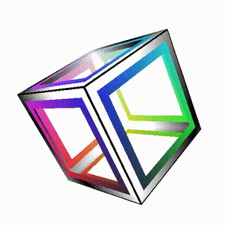

# glumpy-shaders
#### A lab I did revisiting OpenGL after about 20 years.  
For this I used <a href="https://glumpy.github.io/">glumpy</a>: a wrapper lib around diffrent gl backends and a nice bridge to numpy, which makes it pretty pleasant for data science projects.  
 
At first I had some problem getting glumpy to find glfw (default gl backend). 
After browsing the glumpy source I realised on win32 it either looks for a specific env, not set by conda/pip, or just the glfw3.dll.  
The easiest way to get it working was just to <a href="http://www.glfw.org/download.html">download glfw</a> for windows and copy the glfw3.dll to os system directory.  
I've commented the <a href="glumpy-shaders.py">code</a> pretty verbose but the base came from examples on the <a href="https://www.khronos.org/opengl/wiki/">opengl wiki</a>.

